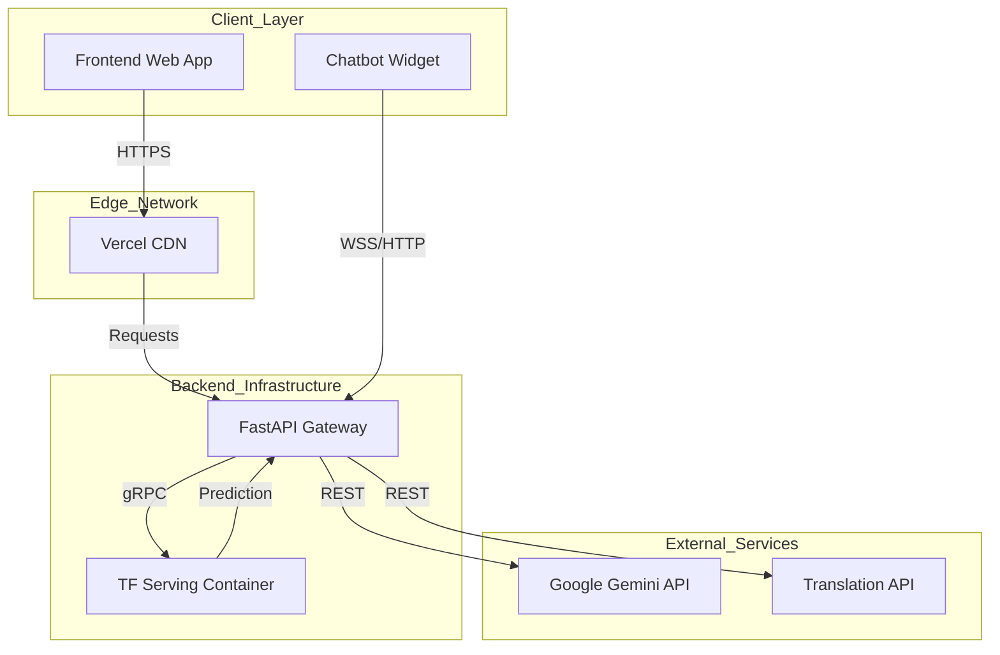
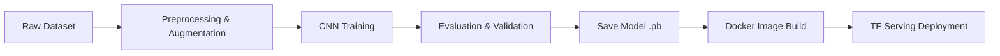

<div align="center">

#  Plant Disease Classification System
### End-to-End MLOps Solution for Precision Agriculture

[](https://www.tensorflow.org/)
[](https://fastapi.tiangolo.com/)
[](https://www.docker.com/)
[](https://deepmind.google/technologies/gemini/)
[](https://blight-detection-in-leaves.vercel.app/)

[View Demo](https://blight-detection-in-leaves.vercel.app/) • [Report Bug](https://github.com/SarvagyaGupta-19/Potato-Disease-Classification-/issues)

</div>

---

## 🚀 Project Overview

The **Plant Disease Classification System** is a production-ready **Computer Vision** application designed to assist farmers in early disease detection. It leverages a custom **Convolutional Neural Network (CNN)** to classify potato leaf diseases (Early Blight, Late Blight) with **96.4% accuracy**.

Beyond simple classification, this project demonstrates a full-stack **MLOps** workflow: from model training and serialization to containerized deployment and integration with Large Language Models (LLMs) for actionable agricultural advice.

### 🔑 Key Capabilities
*   **Real-time Inference**: <100ms latency using TensorFlow Serving.
*   **GenAI Assistant**: Integrated **Google Gemini 2.0** chatbot for context-aware treatment advice.
*   **Scalable Backend**: Asynchronous **FastAPI** microservices architecture.
*   **Global Accessibility**: Bilingual support (English/Hindi) and edge-deployed frontend.

---

## 🏗️ System Architecture

This project adopts a microservices pattern to ensure scalability and maintainability.



## 🔄 Machine Learning Pipeline

The model lifecycle is managed through a structured pipeline ensuring reproducibility.



---

## 🛠️ Technical Highlights & Skills Demonstrated

### 🧠 Deep Learning Engineering
*   **Custom CNN Architecture**: Designed a 3-block VGG-style CNN optimized for the specific texture features of potato leaves.
*   **Data Augmentation**: Implemented rotation, shear, and zoom transformations to combat overcrowding and improve generalization on the PlantVillage dataset.
*   **Model Optimization**: Quantization-ready model structure achieving high accuracy with a lightweight footprint (20MB).

### ⚙️ MLOps & Backend
*   **Containerization**: Dockerized the inference engine (TensorFlow Serving) for consistent environments across dev and production.
*   **High-Performance API**: Utilized FastAPI's `async/await` capabilities to handle concurrent inference and chat requests without blocking.
*   **Model Versioning**: Structured model storage allowing seamless rollbacks and A/B testing capabilities.

### 🤖 Generative AI Integration
*   **RAG-lite Approach**: Injected model prediction results into the LLM context, enabling Gemini to provide specific advice based on the actual visual diagnosis.
*   **Prompt Engineering**: Crafted system prompts to constrain the LLM to agricultural domains and ensure safe, helpful responses.

---

## 📊 Model Performance

The model was evaluated on a held-out test set of 323 images.

| Disease Class | Precision | Recall | F1-Score |
| :--- | :---: | :---: | :---: |
| **Early Blight** | 97.4% | 98.7% | 98.0% |
| **Late Blight** | 93.9% | 96.3% | 95.1% |
| **Healthy** | 92.6% | 97.3% | 94.9% |
| **Overall Accuracy** | | | **96.4%** |

---

## 💻 Tech Stack

| Domain | Technology |
| :--- | :--- |
| **ML Frameworks** | TensorFlow 2.x, Keras, NumPy |
| **Model Serving** | TensorFlow Serving, Docker |
| **Backend API** | FastAPI, Uvicorn, Python 3.11 |
| **LLM / AI** | Google Gemini 2.0 Flash |
| **Frontend** | HTML5, CSS3 (Glassmorphism), JavaScript ES6+ |
| **Deployment** | Render (Backend), Vercel (Frontend) |

---

## ⚡ Quick Start

### Prerequisites
*   Docker & Docker Compose
*   Python 3.10+

### Local Setup
1.  **Clone the repository**
    ```bash
    git clone https://github.com/SarvagyaGupta-19/Potato-Disease-Classification-.git
    ```

2.  **Start the services (Backend + TF Serving)**
    ```bash
    docker-compose up --build
    ```

3.  **Run the Frontend**
    ```bash
    cd frontend
    python -m http.server 5500
    ```
    Visit `http://localhost:5500` to access the application.

---

<div align="center">

**Developed by Sarvagya Gupta**
[LinkedIn](https://www.linkedin.com/in/sarvagyagupta019) • [GitHub](https://github.com/SarvagyaGupta-19)

</div>
